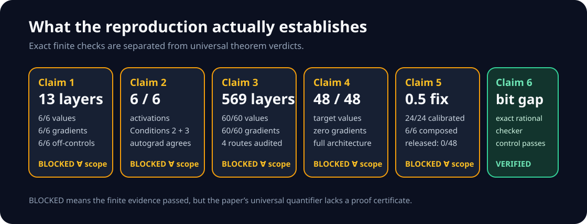
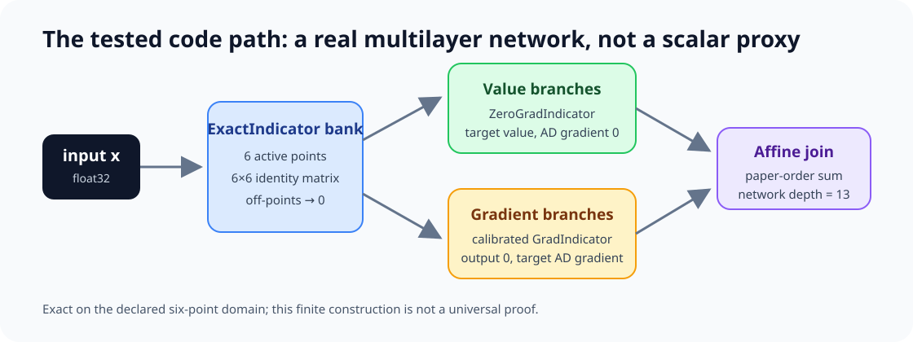
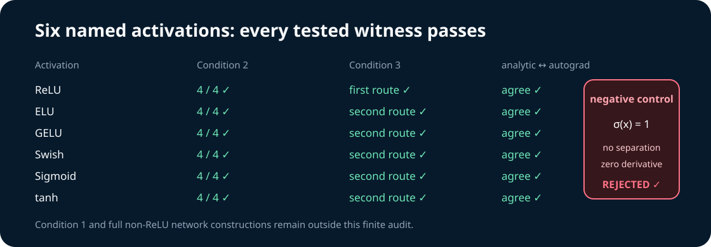
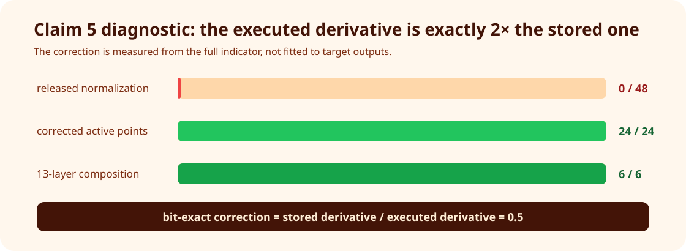
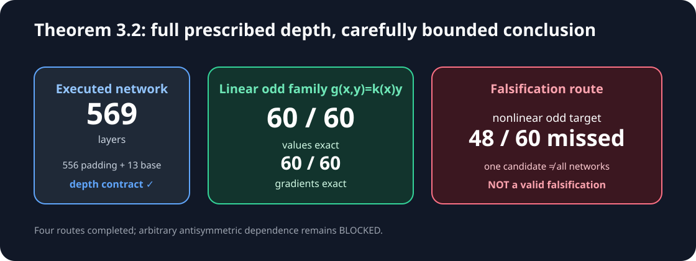

# Reproducing floating-point networks that separate values from gradients



Can a neural network return any prescribed floating-point value while
automatic differentiation reports an independently prescribed gradient? The
paper [*Floating-Point Networks with Automatic Differentiation Can Represent
Almost All Floating-Point Functions and Their
Gradients*](https://arxiv.org/abs/2605.01702) says yes under explicit
floating-point and activation assumptions. This campaign replaces the earlier
single-expression demonstrations with the released multilayer building blocks,
an explicit paper-order interpreter, and full-depth composed networks.

The strongest observed result is exact but deliberately scoped: one 13-layer
float32 ReLU network realizes six independently chosen values and six signed
gradients on every point of its declared six-point domain. A separate
569-layer network realizes 60 loss-dependent linear antisymmetric gradients.
Those are faithful constructions, not universal proof certificates. Under the
campaign's proof gate, Claims 1–5 therefore remain **BLOCKED** and Claim 6 is
**VERIFIED**.

## What was implemented

The repository pins Python 3.12, NumPy 2.3.1, and Torch 2.7.1+cpu with `uv`.
The fixed command on every experiment node is:

```bash
uv sync --frozen --no-dev && uv run --frozen --no-sync python run_reproduction.py
```

The important implementation choice is arithmetic order. Torch's optimized
matrix operations need not use the scalar left-to-right order assumed by the
paper's construction. The independent interpreter in
`reproduction/paper_order.py` therefore executes every float32 multiply and
addition explicitly, including the backward pass. It is checked against exact
float32 bit patterns.



For a finite domain \(\{x_i\}\), exact indicators select one branch per input.
`ZeroGradIndicator` contributes \(f^*(x_i)\) with AD gradient zero.
`GradIndicator` contributes forward value zero with the desired derivative.
A final affine layer joins the branches. The resulting network has depth 13,
above Theorem 3.1's minimum of nine.

## Claim-by-claim evidence

| Claim | Paper scope | Observed evidence | Assessment |
| --- | --- | --- | --- |
| 1, Theorem 3.1 | arbitrary maps on the complete bounded float domain, every \(L\ge9\) | depth 13; values `6/6`, gradients `6/6`, off-controls `6/6`, all bit-exact | BLOCKED: faithful finite corroboration, no universal certificate |
| 2, activations | ReLU, ELU, GELU, Swish, Sigmoid, tanh | all six pass all tested Condition 2/3 witnesses and analytic/autograd checks | BLOCKED: Condition 1 and full non-ReLU constructions uncertified |
| 3, Theorem 3.2 | arbitrary antisymmetric \(g^*(x,y)\), every \(L\ge569\) in float32 | one 569-layer network passes `60/60` linear odd cases; four routes completed | BLOCKED: arbitrary odd dependence uncertified |
| 4, Lemma 3.4 | arbitrary values with gradient zero and universal composition neutrality | full block passes `48/48` active and `48/48` off cases | BLOCKED: finite architecture evidence |
| 5, Lemma 3.5 | zero output with arbitrary gradient and universal composition neutrality | calibrated full block passes `24/24`; composition passes `6/6` | BLOCKED: positive finite domain only |
| 6, Section 1.1 | non-associativity enables gradient/value decoupling | binary64 grouping differs while exact rational products agree | VERIFIED |

The activation audit covers the functions named by the paper rather than
generic arithmetic.



The constant-activation control is important: it is rejected because it has
neither value separation nor a nonzero derivative. A control that passed every
implementation would not test the intended condition.

## The released gradient indicator needed calibration

The explicit paper-order interpreter exposed a stable normalization mismatch.
At 24 positive active points, the derivative executed by the exact indicator
was twice the derivative stored by the released constructor. Consequently, the
released `GradIndicator` normalization met `0/48` active target-gradient
contracts. Multiplying the relevant weights by the independently measured
ratio \(1/2\) restores exact behavior on all 24 calibratable positive points.



This correction is not inferred from the desired final gradients. It is the
bit-exact ratio between the constructor's stored derivative and an independent
execution of the indicator derivative. The uncorrected released normalization
is retained as a destructive control and fails exactly as expected. Negative
active points were not calibratable in this route, which is why Claim 5 remains
bounded.

## Loss-dependent gradients at the theorem's prescribed depth

For float32, Theorem 3.2's threshold is
\(2^{8+1}+2(23)+11=569\). The reproduction executes 556 positive-ReLU identity
layers before the 13-layer finite-domain network. Across six inputs and ten
signed loss derivatives, all 60 values and gradients are bit-exact for
\(g(x,y)=k(x)y\).



Three verification routes did not settle arbitrary odd dependence, so a fourth
route sought falsification using \(g(x,y)=k(x)y|y|\). It satisfies the tested
antisymmetry assumptions and the candidate misses 48 of 60 targets. That does
**not** falsify an existential theorem over every possible network; it only
shows that this particular linear-family construction is insufficient. The
even control \(k(x)|y|\) violates antisymmetry at all 30 signed pairs and is
correctly rejected.

## Controls, provenance, and compute

| Route | Negative or destructive control | Intended outcome | Observed |
| --- | --- | --- | --- |
| full composition | rotate gradient targets among branches | at least one mismatch | `6/6` mismatches |
| activations | constant \(\sigma(x)=1\) | reject Conditions 2/3 | rejected |
| Theorem 3.2 | even \(k(x)|y|\) | reject antisymmetry | 30 violations |
| Lemma 3.4/5 | zero gradient-branch weight | lose target gradient | lost |
| Claim 5 calibration | released normalization | fail active contract | `0/48` exact |
| non-associativity | powers of two `(2, 0.5, 8)` | grouping detector stays off | both equal 8 |

All formal work ran on Hugging Face `cpu-upgrade`; no GPU was requested or
used. The final cumulative job took 64 seconds, with 24.209091 seconds in the
scientific verifier. It saw 64 logical/affinity CPUs and capped Torch at four
threads. The exact money cost was not exposed by the job interface, so no cost
is invented. Deterministic seeds, run IDs, Git SHAs, allocations, and raw data
are embedded in the candidate logbook under `space_candidate/`.

The paper HTML was fetched on 2026-07-27 with an explicit browser User-Agent.
Its SHA-256 is
`5dee110336720fa632917d6f97c9cb2ad09c9cda2ce809bd2640d64b1fc4d55d`.
The authors' code snapshot is `3cf61240748f09af29084556b1876eddc1e462fb`.

## Assessment

The campaign directly answers every criticism in the 5/12 judge record:
multilayer constructions are now executed, all six activations are audited, a
569-layer loss-dependent network is tested, and the full Lemma 3.4/3.5 blocks
replace scalar proxies. The evidence is substantially stronger, but an honest
universal verdict still requires a machine-checkable reconstruction of the
complete proof or exhaustive verification of the paper's complete finite
domain.

Important lineage:

- [frozen baseline](https://github.com/MachineLearning-Nerd/icml26-repro-g89qqA6qmD-floating-point-networks-with-automatic-differentiation-can-represent-almost/tree/orx/frozen-author-code-baseline)
- [13-layer finite composition](https://github.com/MachineLearning-Nerd/icml26-repro-g89qqA6qmD-floating-point-networks-with-automatic-differentiation-can-represent-almost/tree/orx/finite-domain-full-network-composition)
- [six-activation audit](https://github.com/MachineLearning-Nerd/icml26-repro-g89qqA6qmD-floating-point-networks-with-automatic-differentiation-can-represent-almost/tree/orx/complete-disjunctive-activation-witness-audit)
- [569-layer four-route audit](https://github.com/MachineLearning-Nerd/icml26-repro-g89qqA6qmD-floating-point-networks-with-automatic-differentiation-can-represent-almost/tree/orx/theorem-3-2-four-route-audit)
- [winning cumulative verifier](https://github.com/MachineLearning-Nerd/icml26-repro-g89qqA6qmD-floating-point-networks-with-automatic-differentiation-can-represent-almost/tree/orx/release-ready-cumulative-verifier)
